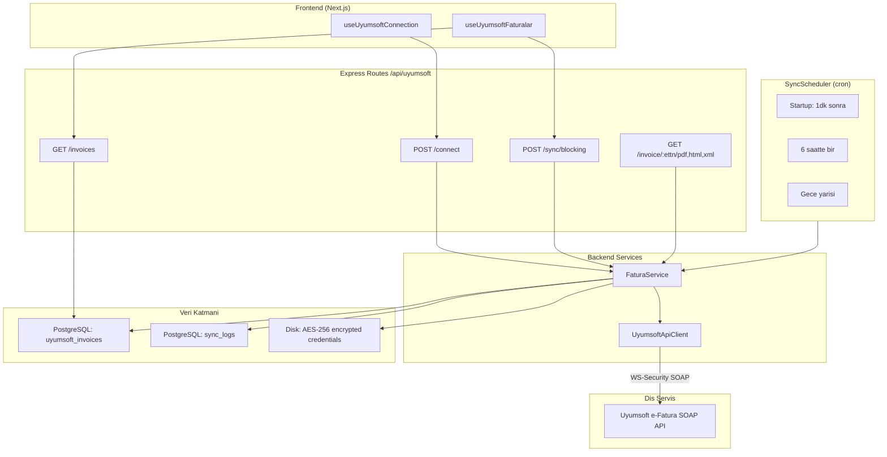
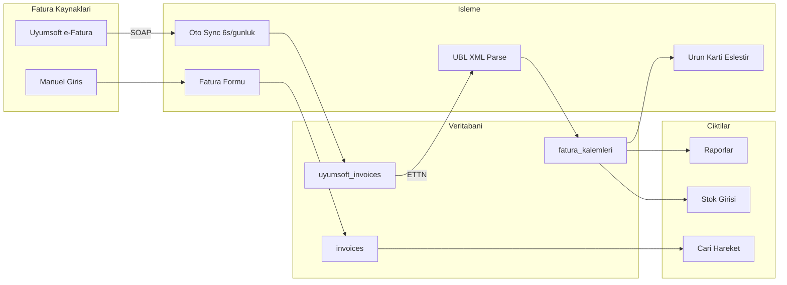
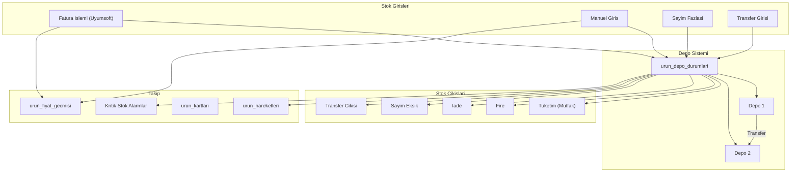
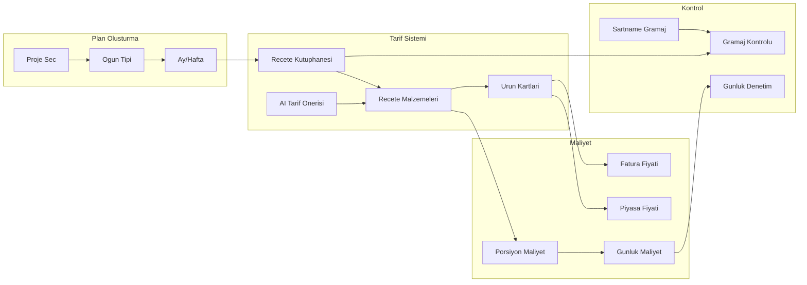
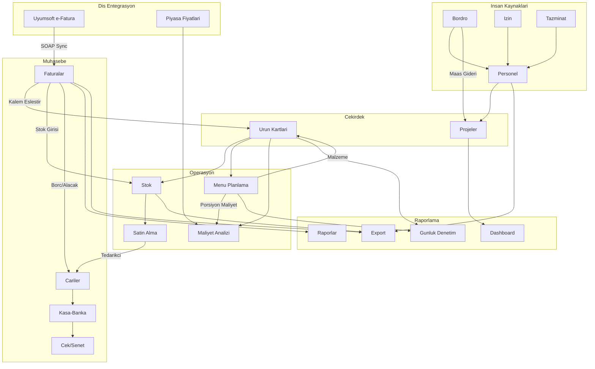

# Alan 4: Muhasebe, Fatura & Finansal Moduller - Tam Analiz Raporu

> Son Guncelleme: 7 Subat 2026
> Analiz Kapsamı: ~126 dosya, 3 part
> Versiyon: 1.0

---

## Icerik

- [PART 1/3: Fatura, Cariler ve Uyumsoft Entegrasyonu](#part-13-fatura-cariler-ve-uyumsoft-entegrasyonu)
- [PART 2/3: Stok, Satin Alma, Personel ve Bordro](#part-23-stok-satin-alma-personel-ve-bordro)
- [PART 3/3: Raporlama, Import/Export, Menu Planlama ve Maliyet](#part-33-raporlama-importexport-menu-planlama-ve-maliyet)
- [Genel Degerlendirme](#genel-degerlendirme)

---

## PART 1/3: Fatura, Cariler ve Uyumsoft Entegrasyonu

### A) Uyumsoft Entegrasyonu

**Uyumsoft nedir?** Turkiye'nin e-Fatura (elektronik fatura) saglayicisi. Sistem `https://efatura.uyumsoft.com.tr/Services/Integration` adresine **SOAP web servisi** uzerinden baglanir (REST veya web scraping degil).

**Baglanti yontemi:** WS-Security (UsernameToken) ile her SOAP isteginde kullanici adi/sifre XML envelope header'ina gomulur. Her istek bagimsizdir (stateless).

**Session yonetimi:** Uyumsoft API'ye session/token yoktur. Ancak lokal olarak:

- Kimlik bilgileri **AES-256-CBC** ile sifrelenerek `backend/storage/uyumsoft-session.json` dosyasinda saklanir
- Env variable'lar (`UYUMSOFT_USERNAME/PASSWORD`) dosyadaki bilgileri override eder
- Sync gecmisi `uyumsoft-session-sync.json`'da takip edilir

**API Client endpoint'leri** (`backend/src/scraper/uyumsoft/api-client.js`): 6 SOAP operasyonu:

- `TestConnection` - Baglanti testi
- `WhoAmI` - Kullanici/sirket bilgisi
- `GetInboxInvoiceList` - Gelen fatura listesi (sayfalanmis, tarih filtreli)
- `GetInboxInvoice` - Tek fatura UBL XML
- `GetInboxInvoiceView` - Fatura HTML gorunumu
- `GetInboxInvoicePdf` - Fatura PDF (Base64)

**Fatura cekme sureci** (`backend/src/scraper/uyumsoft/fatura-service.js`):

1. Credential'lari yukle, API client olustur
2. Tarih araligi hesapla (varsayilan 3 ay geriye)
3. Sayfa sayfa faturalari cek (sayfa basi 100, 200ms rate-limiting)
4. Maksimum 1000 fatura ile sinirla
5. Son sync zamanini kaydet

**Cift yonlu senkronizasyon:** **HAYIR - Tek yonlu (Uyumsoft -> Sistem)**

- Gelen faturalar: Tam calisiyor. SOAP API'den cekilip `uyumsoft_invoices` tablosuna yaziliyor
- Giden faturalar: `backend/src/services/uyumsoft-sales.js` dosyasinda iskelet kod var (`sendInvoiceToUyumsoft`, `createEArchiveInvoice`, `cancelInvoice`) ama cagrilan SOAP metodlar henuz implement edilmemis - calistirilirsa hata verir

**Senkronizasyon zamanlayici** (`backend/src/services/sync-scheduler.js`):

| Zaman | Tip | Kapsam |
|---|---|---|
| Baslangicta (60sn sonra) | Startup | Son 1 ay (son sync 1 saatten eskiyse) |
| Her 6 saatte | Duzenli | Son 1 ay |
| Her gece yarisi | Tam | Son 3 ay, maks 1000 fatura |
| Pazartesi 09:00 | Haftalik | Ozet istatistik |

**Hata yonetimi:**

- SOAP seviyesi: 60sn timeout, fault message parse
- Servis seviyesi: try/catch ile `{ success: false }` donusu
- Scheduler: PostgreSQL advisory lock (`pg_try_advisory_lock(12345)`) + batch INSERT/UPDATE fallback + `sync_logs` tablosuna kayit + `finally` blogu ile lock serbest birakma



---

### B) Fatura Yonetimi

**Backend endpoint'leri** (`backend/src/routes/invoices.js`) - 9 endpoint:

| Method | Path | Aciklama | Auth |
|---|---|---|---|
| GET | /stats | Dashboard istatistikleri (son 30 gun) | Yok |
| GET | / | Fatura listesi (filtreli) | Yok |
| GET | /:id | Tek fatura detay | Yok |
| POST | / | Yeni fatura olustur | fatura:create |
| PUT | /:id | Fatura guncelle | fatura:edit |
| PATCH | /:id/status | Durum guncelle | Yok |
| DELETE | /:id | Fatura sil | fatura:delete |
| GET | /summary/monthly | Aylik ozet | Yok |
| GET | /summary/category | Kategori bazli ozet | Yok |

**Fatura Kalemleri** (`backend/src/routes/fatura-kalemler.js`) - **TEK KAYNAK** prensibi ile 16+ endpoint:

- Fatura islemleri: Liste + kalem getir (Uyumsoft XML parse + cache)
- Eslestirme: Tekli, toplu, otomatik eslestir + eslestirme kaldir
- Urun arama: Arama + oneriler + hizli olustur
- Fiyatlandirma: Guncel fiyatlar, fiyat gecmisi, tedarikci karsilastirma
- Raporlar: Eslestirme durumu, kategori harcama, tedarikci ozet

**ETTN (Elektronik Fatura Takip Numarasi):** GIB sistemindeki her e-faturanin benzersiz UUID kimligidir. `uyumsoft_invoices` ve `fatura_kalemleri` tablolarinda primary key olarak kullanilir.

**invoice-ai.js** (`backend/src/services/invoice-ai.js`): OCR veya anomali tespiti **degil**, dogal dil sorgu motoru:

- "Bu ay tavuk ne kadar harcadik?" gibi Turkce soruyu parse eder
- Tarih araligi, kategori, sorgu tipi (toplam/maks/min/ort) tespit eder
- SQL sonuclarini formatlanmis Turkce yanita cevirir

**Fatura onay sureci:** Veritabaninda `WaitingForAprovement`, `Approved`, `Rejected` statusleri var ama **frontend'de tam implement edilmemis**. Mevcut akis: `taslak -> gonderildi -> odendi/gecikti/iptal`

**e-Fatura entegrasyonu:** Uyumsoft uzerinden tam calisir. Fatura kalem cache'i: Ilk erisimde XML cekilip parse edilir, sonraki erisimlerde DB'den okunur.

**Frontend hook'lari:**

| Hook | Gorev |
|---|---|
| `useFaturalar` | Manuel fatura CRUD + filtreleme + istatistik |
| `useFaturaForm` | Fatura olusturma/duzenleme formu + validasyon + hesaplama |
| `useUyumsoftFaturalar` | e-Fatura listesi + sync + filtreleme |
| `useUyumsoftConnection` | Uyumsoft baglanti yasam dongusu |

**Neden iki API client?**

- `frontend/src/lib/invoice-api.ts`: Fatura baslik/zarf CRUD (`/api/invoices`) + Uyumsoft baglanti (`/api/uyumsoft`)
- `frontend/src/lib/api/services/fatura-kalemleri.ts`: Kalem-seviye islemler (`/api/fatura-kalemleri`) - eslestirme, fiyat, rapor

---

### C) Cari Hesaplar

**Cari hesap modeli** (`backend/src/routes/cariler.js`):

- `borc` (borc), `alacak` (alacak), `bakiye` (bakiye = alacak - borc)
- `kredi_limiti`, tip: musteri/tedarikci/her_ikisi
- `cari_hareketler` tablosu: hareket bazli borc/alacak, SQL window function ile running balance

**Mutabakat** (`backend/src/routes/mutabakat.js`) - 3 gorunum:

1. **Ekstre**: 4 kaynaktan (faturalar, e-faturalar, kasa-banka, cek-senet) UNION ALL ile acilis bakiyesi + donem hareketleri + kapanis bakiyesi
2. **Fatura bazli**: Acik/kismi/kapali odeme durumu + odeme eslestirme
3. **Donemsel**: Aylik ozet tablo

**CariDetayModal**: 4 tab - Ozet (kartlar + iletisim), Ekstre (tarih filtreli + CSV export), Gelir/Gider (6 aylik), Vade (gecikme uyarilari)

**CariListTab vs cariler/page.tsx**: cariler/page.tsx artik **redirect** - `/muhasebe/finans?tab=cariler` adresine yonlendirir. Tek aktif liste: `CariListTab` (Finans Merkezi icinde)

**CariDetailDrawer**: Sag taraftan acilan Mantine `<Drawer>` paneli. Hizli islem butonlari + bakiye kartlari + Timeline gorunumunde son 20 hareket. CariDetayModal'dan daha hafif, hizli bakis icin.

---

### D) Firmalar ve Sync

**Firmalar vs Cariler:**

- **Cariler** = Dis taraflar (musteri/tedarikci), finansal takip (borc/alacak)
- **Firmalar** = Kendi sirket bilgileriniz (ihale islemleri icin), finansal takip yok
- Dogrudan foreign key yok, farkli alan (domain): Firmalar = kimlik/uyum, Cariler = muhasebe

**firma-belge-service** (`backend/src/services/firma-belge-service.js`): **Claude AI ile belge analizi**:

- Vergi levhasi, sicil gazetesi, imza sirkuleri, faaliyet belgesi, ISO/HACCP sertifikasi, vekaletname
- PDF (pdf-parse + Vision fallback), Word (mammoth), Excel (xlsx), Gorsel (Claude Vision)
- Otomatik tip tespiti + yapilandirilmis veri cikarma + guven skoru + opsiyonel otomatik form doldurma

**Sync:** Uyumsoft -> Supabase senkronizasyonu tamamen otomatik (scheduler). Manuel tetikleme de mumkun (`/api/sync/manual`, `/api/sync/date-range`, vs.)

---

### Fatura Yasam Dongusu



---

## PART 2/3: Stok, Satin Alma, Personel ve Bordro

### A) Stok Yonetimi

**Desteklenen islemler** (`backend/src/routes/stok.js`):

| Islem | Modal | Endpoint |
|---|---|---|
| Stok Giris | StokGirisModal | POST /hareketler/giris |
| Stok Cikis | StokCikisModal | POST /hareketler/cikis |
| Transfer | TransferModal | POST /hareketler/transfer |
| Sayim | SayimModal | Fark bazli giris/cikis |
| Depo CRUD | DepoModal | POST/PUT/DELETE /depolar |
| Faturadan Giris | FaturaIslemModal | POST /faturadan-giris |
| Toplu Fatura | FaturaIslemModal | POST /toplu-fatura-isle |
| Akilli Eslestir | FaturaIslemModal | POST /akilli-eslestir |

**Depo sistemi:** Dinamik (sinir yok). Her depo `depolar` tablosunda, alt lokasyonlar `depo_lokasyonlar`da (soguk_hava, dondurulmus, kuru_gida, vs.). Stogu olan depo silinemez.

**Transfer akisi:** Kaynak depo secimi + hedef depo + miktar -> kullanilabilir stok kontrolu (`miktar - rezerve_miktar`) -> DB trigger ile her iki depo guncellenir.

**Sayim:** SayimModal'da depo secimi -> mevcut stoklar yuklenir -> fiziksel sayim girilir -> fark hesaplami (gercek zamanli, renk kodlu) -> fazla icin giris, eksik icin cikis hareketi olusturulur.

**FaturaIslemModal:** Faturadan stok olusturur (tersi degil):

1. Uyumsoft e-fatura listesi gosterir
2. UBL XML parse + `akilli_stok_eslestir()` PostgreSQL fonksiyonu (fuzzy matching, guven skoru)
3. %90+ guven = otomatik eslestir
4. `kontrol_fiyat_anomali()` ile fiyat degisim uyarisi

**Minimum stok uyarisi:** 3 katmanli:

- `kritik_stok` (kirmizi), `min_stok` (turuncu), `max_stok` (mavi)
- Durum: tukendi -> kritik -> dusuk -> fazla -> normal
- Kritik urunler icin "Satin Al" butonu `/muhasebe/satin-alma?urun=X&miktar=Y` linkine yonlendirir
- **Otomatik bildirim/email yok** - sadece goruntusel

**Birim donusum:** 2 seviye:

1. UBL birim kodlari donusumu (`ubl_birim_donusum` tablosu, carpan ile)
2. Urun bazli `birim_carpani` (orn: 48x250gr = 12 KG)

**Stok degerleme:** FIFO/LIFO yok, **son alis fiyati** modeli (`son_alis_fiyati`)



---

### B) Satin Alma

**Akis** (`backend/src/routes/satin-alma.js`):
Tip sisteminde 6 durum tanimli ama frontend'de basitlestirilmis 3 adim:

1. `talep` (Siparis Olusturuldu)
2. `siparis_verildi` (Tedarikciye Gonderildi)
3. `teslim_alindi` (Teslim Alindi)

`onay_bekliyor` ve `onaylandi` adimlari tip'te var ama UI'da atlanir - **resmi onay akisi yok**.

**Ozellikler:** Proje/sube atama, tedarikci secimi (cariler'den), oncelik seviyeleri (dusuk/normal/yuksek/acil), yazdirilabilir siparis formu, proje/tedarikci bazli raporlar, Supabase Realtime.

**Piyasa fiyat karsilastirmasi** (`backend/src/services/ai-tools/piyasa-tools.js`):

- Market web sitelerinden canli fiyat tarama (ScrapingBee/Playwright)
- min/maks/ortalama fiyat + tedarikci fiyati ile karsilastirma
- Claude AI ile Turkce gida urunu yazim duzeltmesi
- `piyasa_takip_listesi` ile fiyat takip listesi
- `piyasa_fiyat_gecmisi`'ne her arastirma kaydedilir

**AI satin alma araclari** (`backend/src/services/ai-tools/satin-alma-tools.js`):
Chat arayuzu uzerinden siparis CRUD, proje yonetimi, donem ozetleri. **Otomatik yeniden siparis, talep tahmini veya EOQ hesabi yok.**

---

### C) Personel Yonetimi

**Personel verisi** (`backend/src/routes/personel.js`):

- Kimlik: ad, soyad, TC, dogum tarihi, cinsiyet, sicil no
- Iletisim: telefon, email, adres, acil kisi
- Pozisyon: departman, pozisyon, ise giris/cikis tarihi, durum (aktif/izinli/pasif)
- Maas: net maas, bordro maas (resmi), IBAN, medeni durum, cocuk sayisi, SGK no
- Proje atama: coktan-coka iliski, gorev/baslangic/bitis tarihleri

**Izin yonetimi** (`backend/src/routes/izin.js`):

- Turler: yillik, ucretsiz, mazeret, rapor, evlilik, dogum (anne/baba), olum
- Akis: Talep olustur -> cakisma kontrolu -> `beklemede -> onaylandi/reddedildi/iptal`
- Yarim gun destegi
- Kidem bazli hak hesaplama (1-5 yil: 14 gun, 5-15: 20 gun, 15+: 26 gun - Is Kanunu 4857 m.53)

**Maas-odeme** (`backend/src/routes/maas-odeme.js`):
**Odeme takip sistemi** (hesaplayici degil):

- Aylik odeme olusturma: `bordro_maas` (resmi) + `elden_fark` (maas - bordro_maas)
- Banka/elden odeme durum takibi
- Avans ve prim hareketleri
- Proje bazli aylik odemeler (SGK, gelir vergisi, damga vergisi, issizlik sigortasi)
- Finalize: Tum odemeler tamamlaninca `proje_hareketler`'e gider kaydi yazar

**Tazminat hesaplama** (`backend/src/services/tazminat-service.js`):

- Kidem tazminati: Her tam yil icin 30 gun brut maas, tavan siniri
- Ihbar tazminati: Kidem bazli sureler (0-6ay: 14gun, 6-18: 28gun, 18-36: 42gun, 36+: 56gun)
- Kullanilmamis izin ucreti
- Cikis sebebine gore hak matrisi (isveren feshi, istifa, emeklilik, evlilik, askerlik, olum)
- Risk analizi: Tum aktif personel icin potansiyel tazminat yukumlulugu

**AI personel araclari** (`backend/src/services/ai-tools/personel-tools.js`): 12 arac - personel CRUD, bordro hesapla, izin islemleri, kidem hesapla, 2026 mevzuat bilgisi

---

### D) Bordro

**Bordro sistemi** (`backend/src/routes/bordro.js`):
Tam Turk bordro hesaplama motoru:

- Brut maas -> SGK (%14+%1 isci, %15.5+%2 isveren) -> Gelir vergisi (5 dilim %15-%40) -> Damga vergisi (%0.759) -> AGI -> Net maas
- **Net-to-gross ters hesaplama** (iteratif yaklasim, 1 TL tolerans)
- Kumulatif vergi matrahi takibi (yillik dilim dogrulugu icin)
- Donem ozetleri + odeme durum yonetimi

**Bordro import** (`backend/src/services/bordro-import-service.js`):

- Format: Excel (.xlsx/.xls), CSV, **PDF** (pdf-parse ile)
- 2 katmanli analiz: Template varsa aninda parse, yoksa **Claude AI** fallback
- Personel eslestirme: TC -> SGK No -> isim benzerligi (3 adim)
- Cifte dogrulama: Bireysel kayitlar toplami vs TAHAKKUK ozet tablosu (1 TL tolerans)

**BordroImportModal**: 4 adimli sihirbaz:

0. Proje + donem sec
1. Dosya yukle (drag-drop + template secimi)
2. Eslestirme ve inceleme (TAHAKKUK dogrulama paneli, eslesmemis kayit olusturma)
3. Onay ve kayit

---

### E) Demirbas ve Kasa-Banka

**Demirbas** (`backend/src/routes/demirbas.js`):

- Varlik takibi: kod (DMB-YYYY-NNNN), barkod, marka/model/seri no, alis bilgileri, garanti, konum, proje
- **Amortisman: Evet** - dogrusal yontem, faydali omur (varsayilan 5 yil), hurda degeri, birikimis amortisman, net defter degeri
- Zimmet: Atama -> iade -> transfer dongusu
- Bakim: Servise gonder -> servisten don (gercek maliyet, yapilan is, degisen parca)
- Arac modulu: Plaka, sasi no, motor, yakit, km, sigorta/muayene tarihleri
- Hareket gecmisi: Her islem loglanir

**Kasa-Banka** (`backend/src/routes/kasa-banka.js`):

- Hesap tipleri: kasa, banka, kredi_karti
- Gelir/gider islemleri + hesaplar arasi transfer
- **Cek/Senet:** Tam yasam dongusu (beklemede -> tahsil/odeme/ciro/iade), alinan/verilen iki yon
- Dashboard: Toplam nakit/banka/kredi karti bakiyeleri, bekleyen cek/senet tutarlari, yaklasan vadeler

**Frontend not:** `kasa-banka/page.tsx` ve `gelir-gider/page.tsx` artik `/muhasebe/finans` adresine redirect. Tum finans islemleri **Finans Merkezi** sayfasinda birlestirilmis.

---

### F) Backend Utils

**birim-donusum** (`backend/src/utils/birim-donusum.js`):

- DB tabanli: `birim_eslestirme` (varyasyon -> standart) + `birim_donusumleri` (carpan)
- In-memory cache ile performans
- Gida birimleri odakli: gr, kg, lt, ml, adet

**fiyat-hesaplama** (`backend/src/utils/fiyat-hesaplama.js`):

- KDV/iskonto/kar marji **hesaplamaz** - malzeme maliyet hesaplama odakli
- Fiyat kaynak onceligi: Guncel fatura (90 gun) > Piyasa > Eski fatura > Manuel > Sifir
- Birim donusum ile standart birim fiyat hesaplama
- Fatura vs piyasa fiyat farki analizi (%10 esik)
- Maliyet audit log (%5+ degisimde)

---

## PART 3/3: Raporlama, Import/Export, Menu Planlama ve Maliyet

### A) Raporlama ve Dashboard

**Raporlar sayfasi** (`frontend/src/app/muhasebe/raporlar/page.tsx`):

- **Statik/demo veri** kullanir (henuz backend'e baglanmamis)
- KPI'lar: Toplam Gelir, Toplam Gider, Net Kar, Kar Marji (yillik degisim yuzdeleri)
- Grafikler: Gelir/Gider trend (AreaChart), Gider dagilimi (PieChart), Departman maliyetleri (BarChart), Aylik kar trendi (LineChart) - **Recharts** kutuphanesi
- Tablolar: Stok ozeti, alacak/borc ozeti, aylik gelir/gider detay
- Kontroller: Aylik/Yillik toggle, Yazdir, Excel indir

**Dashboard** (`frontend/src/app/muhasebe/raporlar/dashboard/page.tsx`):

- **Canli veri** (backend'e bagli)
- KPI'lar: Toplam Alis, Toplam Satis, Fatura Sayisi, Net Kar/Zarar
- Kategori dagilimi: Tavuk, et, sebze, bakliyat vs. progress bar ile
- Uyumsoft e-Fatura ozeti

**Finans Merkezi** (`frontend/src/app/muhasebe/finans/page.tsx`):
2261 satirlik en kapsamli sayfa, 5 tab:

1. Ozet (bakiyeler, bekleyen cek/senet, son islemler, proje analizi)
2. Cariler (CariListTab + drawer + mutabakat)
3. Hesaplar (kasa/banka/kredi karti CRUD + islem yonetimi)
4. Cek/Senet (alinan/verilen, durum takibi, islem menuleri)
5. Proje Karlilik (proje bazli kar/zarar, personel/SGK/vergi giderleri, hakedis geliri)

- Supabase Realtime ile canli guncelleme

**AI rapor araclari** (`backend/src/services/ai-tools/rapor-tools.js`): 5 arac - sistem ozeti, proje harcama, tedarikci performans, donem karsilastirma, kritik uyarilar

---

### B) Import/Export

**Import** (`backend/src/services/import-service.js`):

- Formatlar: PDF, Excel, CSV, Word, TXT, JPEG/PNG (Claude Vision OCR)
- Hedef semalar: personel, bordro, stok, cari, fatura, menu, gramaj
- **Claude Sonnet AI** ile akilli parse + sema eslestirme
- Menu-spesifik analiz: Yemek kategorileme + beslenme tahmini

**Export** (`backend/src/routes/export.js`): 17 endpoint, 6 kategori:

- Personel, Fatura, Cari, Stok, Bordro, Izin Excel/PDF/Email
- Dilekce PDF (ihale itiraz, sikayet, KIK basvuru)
- `pdfkit` (Roboto font, Turkce karakter) + `xlsx`

**Import/Export Destek Matrisi:**

| Modul | Import | Export Excel | Export PDF | Export Email |
|---|---|---|---|---|
| Personel | AI (Excel/PDF/Image) | Evet | Evet | Evet |
| Bordro | AI (Excel/PDF) + Template | Evet | Evet | - |
| Stok | AI (Excel/PDF) | Evet | Evet | Evet |
| Cari | AI (Excel/PDF) | Evet | Evet | Evet |
| Fatura | AI (Excel/PDF) | Evet | Evet | Evet |
| Menu | AI (Excel/PDF/Image) | - | - | - |
| Izin | - | Evet | Evet | - |
| Dilekce | - | - | Evet | - |

**ImportModal UX:** 3 adimli sihirbaz: Modul sec + template indir -> Dosya yukle (drag-drop) -> AI analiz sonucu onizleme + secim + onay

---

### C) Menu Planlama

**Backend** (`backend/src/routes/menu-planlama.js`): En buyuk route dosyasi, ~2878 satir, ~50 endpoint:

- Recete CRUD + malzeme yonetimi + otomatik maliyet hesaplama
- Ogun tipleri (kahvalti/ogle/aksam) + proje bazli ogun sablonlari
- Aylik/haftalik menu plan yonetimi
- Sartname yonetimi (kurum bazli porsiyon/gramaj kurallari)
- Menu import (Excel/PDF/gorsel)
- AI tarif onerisi (Claude ile malzeme tavsiyesi + urun karti eslestirme)

**Frontend bilesenler:**

- `MenuTakvim`: Takvim bazli gorunum (haftalik/aylik)
- `MenuSidebar`: Proje + ogun tipi secimi + tarif kategorileri
- `MenuKutuphanesi`: Tarif kutuphanesi (arama + filtreleme + yeni tarif)
- `KaydedilenMenuler`: Daha once kaydetilmis menu sablonlari
- `ReceteModal`: Tarif detay (malzemeler, gramaj, beslenme bilgisi, maliyet)
- `YeniProjeModal`: Ihale bazli menu planlama projesi olusturma
- `MenuKaydetForm`: Menu plan kaydetme formu

**Menu planlama akisi:**



---

### D) Maliyet Analizi

**Backend** (`backend/src/routes/maliyet-analizi.js`):

- Kategori bazli maliyet sablonlari
- Sablon: Menu planlarindan veya sifirdan olusturulabilir
- Her sablon: yemekler -> malzemeler -> 3 fiyat kaynagi (sistem/piyasa/manuel)
- Karsilastirma: 2+ sablon yan yana maliyet karsilastirmasi
- Recete maliyet detay: Malzeme bazli fatura vs piyasa fiyat, tazelik gostergesi

**Maliyet hesaplama zinciri:**

```
Birim Fiyat (TL/kg) x Miktar (kg) = Malzeme Maliyeti
SUM(Malzeme Maliyetleri) = Tarif Maliyeti (1 porsiyon)
Tarif Maliyeti x Kisi Sayisi = Ogun Maliyeti
SUM(Ogun Maliyetleri) = Gunluk Maliyet
Gunluk Maliyet x 30 = Aylik Maliyet
```

**ambalajParser** (`backend/src/services/ambalajParser.js`): Urun adlarindan ambalaj bilgisi cikarir (orn: "48x250gr" -> carpan:48, birim_miktar:250, birim:gr, toplam:12kg)

---

### E) Proje ve Etiket Yonetimi

**Projeler** (`backend/src/routes/projeler.js`): Merkezi varlik - 1509 satir:

- "Proje" = **Ihale projesi / maliyet merkezi** (KYK yurdu, okul, hastane vb.)
- 40+ alan: Sozlesme detaylari, fatura bilgileri, kapasite, hakedis, yetkili kisiler
- Coklu modul baglantisi: Personel, siparis, hareket, bordro, satin alma, finans
- Dashboard: Tum projeler ozeti + proje bazli maliyet analizi

**Proje hareketleri** (`backend/src/routes/proje-hareketler.js`): Proje bazli gelir/gider kaydi + personel giderleri otomasyonu + coklu proje ozeti

**Etiketler** (`backend/src/routes/etiketler.js`): Fatura etiketleme sistemi - CRUD + ETTN bazli atama + toplu islem + etiket bazli raporlama

---

### F) Data Import Scriptleri

| Script | Amac | Tek Seferlik? |
|---|---|---|
| import-ocak-menu.js | Ocak 2026 kahvalti/aksam menusu Excel'den API uzerinden | Evet |
| kahvalti-import.js | Ayni kahvalti verisi, dogrudan DB'ye | Evet |
| import-kahvalti.js | Sadece benzersiz yemek adlarini recete olarak olusturma | Evet |
| import-uyumsoft-cariler.js | Uyumsoft faturalarindan cari kayit cikarma | Evet |
| add-kyk-malzemeler.js | ~60 tarife KYK 2025 standart malzeme verisi | Evet |
| add-kyk-recipes.js | ~70 KYK tarif kaydi (beslenme bilgili) | Evet |
| excel-to-menu-plan.js | Excel'den menu plani olusturma (en kapsamli) | Evet |

**KYK = Kredi ve Yurtlar Kurumu** - Universite ogrenci yurtlari. Standart porsiyon gramajlari ve beslenme kurallari tanimli.

**Excel formati:** Sutunsal yapi - tarih baslik satirinda, yemekler dikey olarak altinda. Kahvalti dosyasi D/M/YY text tarih, aksam dosyasi Excel seri numarasi tarih.

---

### G) Gunluk Denetim

**daily-audit-v2** (`backend/src/services/daily-audit-v2.js`): 1745 satir, otomatik kalite kontrol sistemi:

3 denetim kategorisi:

1. **Recete:** Eksik fiyat, hesaplanmamis maliyet, anormal maliyet (%50+ sapma), eslesmemis malzeme
2. **Menu:** Ayni hafta tekrar eden yemek, bos gelecek ogunler, butce asimi
3. **Fiyat:** Eski fiyatlar, fiyat anomalileri, dusuk guvenli AI tahminleri, fiyatsiz urunler

Otomatik duzeltme: Recete maliyeti yeniden hesapla, AI fiyat tahmini, isim benzerligi ile urun eslestirme.
Claude AI ile kritik bulgularin kok neden analizi + etki degerlendirmesi.

---

## Genel Degerlendirme

### Modul Iliski Haritasi



---

### Veri Senkronizasyon Matrisi

| Kaynak | Hedef | Yontem | Siklik | Durum |
|---|---|---|---|---|
| Uyumsoft e-Fatura | uyumsoft_invoices | SOAP API | 6 saat + gece yarisi | Aktif |
| uyumsoft_invoices | fatura_kalemleri | UBL XML parse | Ilk erisimde | Aktif |
| fatura_kalemleri | urun_kartlari | Akilli eslestirme | Manuel tetikleme | Aktif |
| fatura_kalemleri | urun_depo_durumlari | Faturadan giris | Manuel tetikleme | Aktif |
| invoices | cari_hareketler | DB trigger | Otomatik | Aktif |
| kasa_banka_hareketler | cari_hareketler | DB trigger | Otomatik | Aktif |
| bordro_kayitlari | proje_hareketler | Finalize islemi | Manuel tetikleme | Aktif |
| Sistem -> Uyumsoft | - | - | - | Henuz yok |
| Piyasa web siteleri | piyasa_fiyat_gecmisi | Web scraping + AI | Manuel tetikleme | Aktif |

---

### Tam API Endpoint Listesi

#### Uyumsoft (/api/uyumsoft)
- POST /connect - Yeni credential ile baglanti
- POST /connect-saved - Kayitli credential ile baglanti
- GET /status - Baglanti durumu
- POST /sync/blocking - Manuel sync
- GET /invoices - Fatura listesi (DB'den)
- GET /invoices/summary - Fatura ozeti
- GET /invoice/:ettn - Tek fatura (DB'den)
- GET /invoice/:ettn/pdf - Fatura PDF (Uyumsoft'tan canli)
- GET /invoice/:ettn/xml - Fatura XML (Uyumsoft'tan canli)
- GET /invoice/:ettn/html - Fatura HTML (Uyumsoft'tan canli)

#### Faturalar (/api/invoices)
- GET / - Fatura listesi
- GET /stats - Dashboard istatistikleri
- GET /:id - Tek fatura
- POST / - Yeni fatura
- PUT /:id - Fatura guncelle
- PATCH /:id/status - Durum guncelle
- DELETE /:id - Fatura sil
- GET /summary/monthly - Aylik ozet
- GET /summary/category - Kategori ozeti

#### Fatura Kalemleri (/api/fatura-kalemleri)
- GET /faturalar - Fatura listesi (kalem eslestirme istatistikleriyle)
- GET /faturalar/:ettn/kalemler - Fatura kalemleri
- POST /faturalar/:ettn/kalemler/:sira/eslesdir - Tekli eslestir
- POST /faturalar/:ettn/toplu-eslesdir - Toplu eslestir
- POST /faturalar/:ettn/otomatik-eslesdir - Otomatik eslestir
- DELETE /faturalar/:ettn/kalemler/:sira/eslesme - Eslestirme kaldir
- GET /urunler/ara - Urun arama
- GET /urunler/oneriler - Urun onerileri
- POST /urunler/hizli-olustur - Hizli urun olustur
- GET /fiyatlar/guncel - Guncel fiyatlar
- GET /fiyatlar/:urunId/gecmis - Fiyat gecmisi
- GET /fiyatlar/tedarikci-karsilastirma - Tedarikci karsilastirma
- GET /raporlar/eslesme-durumu - Eslestirme raporu
- GET /raporlar/kategori-harcama - Kategori harcama raporu
- GET /raporlar/tedarikci-ozet - Tedarikci ozet raporu

#### Cariler (/api/cariler)
- GET / - Cari listesi
- GET /:id - Tek cari
- POST / - Yeni cari
- PUT /:id - Cari guncelle
- DELETE /:id - Cari sil
- GET /:id/hareketler - Cari hareketleri
- GET /:id/ekstre - Cari ekstre

#### Mutabakat (/api/mutabakat)
- GET /ekstre/:cariId - Cari ekstre (4 kaynakli)
- GET /fatura-bazli/:cariId - Fatura bazli mutabakat
- GET /donemsel/:cariId - Donemsel mutabakat
- POST /fatura-odeme - Fatura odeme eslestirme

#### Stok (/api/stok)
- GET /urunler - Urun listesi (stok durumlari ile)
- GET /depolar - Depo listesi
- POST /depolar - Yeni depo
- PUT /depolar/:id - Depo guncelle
- DELETE /depolar/:id - Depo sil
- POST /hareketler/giris - Stok girisi
- POST /hareketler/cikis - Stok cikisi
- POST /hareketler/transfer - Depolar arasi transfer
- GET /hareketler - Hareket listesi
- GET /kritik - Kritik stok urunleri
- POST /faturadan-giris - Faturadan stok girisi
- POST /toplu-fatura-isle - Toplu fatura isleme
- POST /akilli-eslestir - Akilli urun eslestirme

#### Urunler (/api/urunler)
- GET / - Urun kartlari listesi
- GET /:id - Tek urun karti
- POST / - Yeni urun karti
- PUT /:id - Urun guncelle
- DELETE /:id - Urun sil
- POST /varyant-olustur - Urun varyanti olustur

#### Satin Alma (/api/satin-alma)
- GET / - Siparis listesi
- GET /:id - Tek siparis
- POST / - Yeni siparis
- PUT /:id - Siparis guncelle
- PATCH /:id/durum - Durum guncelle
- DELETE /:id - Siparis sil

#### Personel (/api/personel)
- GET / - Personel listesi
- GET /:id - Tek personel
- POST / - Yeni personel
- PUT /:id - Personel guncelle
- DELETE /:id - Personel sil

#### Izin (/api/izin)
- GET /talepler - Izin talepleri listesi
- POST /talepler - Yeni izin talebi
- PATCH /talepler/:id/durum - Talep durumu guncelle
- DELETE /talepler/:id - Talep sil
- GET /personel/:id/ozet - Personel izin ozeti

#### Bordro (/api/bordro)
- POST /hesapla - Bireysel bordro hesapla
- POST /toplu-hesapla - Toplu bordro hesapla
- GET /ozet/:yil/:ay - Donem ozeti
- GET /kayitlar - Bordro kayitlari

#### Bordro Import (/api/bordro-import)
- POST /analyze - Dosya analizi (AI)
- POST /save - Analiz sonucu kaydet

#### Demirbas (/api/demirbas)
- GET / - Demirbas listesi
- POST / - Yeni demirbas
- PUT /:id - Demirbas guncelle
- DELETE /:id - Demirbas sil
- POST /:id/zimmet - Zimmet atama
- POST /:id/bakim - Bakima gonder

#### Kasa-Banka (/api/kasa-banka)
- GET /hesaplar - Hesap listesi
- POST /hesaplar - Yeni hesap
- GET /hareketler - Hareket listesi
- POST /hareketler - Yeni hareket
- POST /transfer - Hesaplar arasi transfer
- GET /cek-senetler - Cek/senet listesi
- POST /cek-senetler - Yeni cek/senet
- PATCH /cek-senetler/:id/durum - Durum guncelle
- GET /ozet - Dashboard ozet

#### Projeler (/api/projeler)
- GET / - Proje listesi
- GET /:id - Tek proje
- POST / - Yeni proje
- PUT /:id - Proje guncelle
- DELETE /:id - Proje sil
- GET /:id/ozet - Proje ozet
- GET /:id/tam-ozet - Proje tam ozet
- GET /stats/genel-ozet - Tum projeler ozeti

#### Import/Export (/api/import, /api/export)
- POST /import/analyze - AI dosya analizi
- POST /import/confirm - Import onay
- POST /import/menu-analyze - Menu dosya analizi
- POST /import/menu-save - Menu kaydet
- GET /import/template/:type - Sablon indir
- GET /export/personel/excel - Personel Excel
- GET /export/personel/pdf - Personel PDF
- GET /export/fatura/excel - Fatura Excel
- GET /export/fatura/pdf - Fatura PDF
- GET /export/cari/excel - Cari Excel
- GET /export/stok/excel - Stok Excel
- GET /export/bordro/excel - Bordro Excel
- GET /export/izin/excel - Izin Excel
- GET /export/dilekce/pdf - Dilekce PDF

#### Menu Planlama (/api/menu-planlama)
- GET /receteler - Recete listesi
- POST /receteler - Yeni recete
- PUT /receteler/:id - Recete guncelle
- DELETE /receteler/:id - Recete sil
- GET /receteler/:id/malzemeler - Recete malzemeleri
- POST /receteler/:id/malzemeler - Malzeme ekle
- GET /planlar - Menu planlari
- POST /planlar - Yeni plan
- GET /sartnameler - Sartname listesi
- POST /ai/tarif-oneri - AI tarif onerisi

#### Maliyet Analizi (/api/maliyet-analizi)
- GET /kategoriler - Maliyet kategorileri
- GET /sablonlar - Maliyet sablonlari
- POST /sablonlar - Yeni sablon
- GET /sablonlar/:id - Sablon detay
- POST /sablonlar/karsilastir - Sablon karsilastirma
- GET /recete/:id/maliyet - Recete maliyet detay

#### Sync (/api/sync)
- POST /manual - Manuel sync
- POST /date-range - Tarih aralikli sync
- POST /category - Kategori bazli sync
- POST /vendor - Tedarikci bazli sync
- POST /start - Scheduler baslat
- POST /stop - Scheduler durdur
- GET /status - Sync durumu
- GET /logs - Sync loglar

#### Firmalar (/api/firmalar)
- GET / - Firma listesi
- GET /:id - Tek firma
- POST / - Yeni firma
- PUT /:id - Firma guncelle
- POST /:id/dokumanlar - Dokuman yukle + AI analiz
- POST /:id/dokumanlar/:docId/veriyi-uygula - AI verisini firmaya uygula

#### Etiketler (/api/etiketler)
- GET / - Etiket listesi
- POST / - Yeni etiket
- PUT /:id - Etiket guncelle
- DELETE /:id - Etiket sil
- POST /fatura/:ettn - Faturaya etiket ata
- GET /rapor - Etiket bazli rapor

#### Maas Odeme (/api/maas-odeme)
- POST /olustur - Aylik odeme olustur
- PATCH /:id/banka - Banka odemesi isaretle
- PATCH /:id/elden - Elden odeme isaretle
- POST /finalize - Donem finalize

---

### Risk ve Iyilestirme Ozeti

**Guvenlik Riskleri:**

| Risk | Konum | Oncelik |
|---|---|---|
| Fatura GET + PATCH /status endpoint'lerinde auth yok | backend/src/routes/invoices.js | Yuksek |
| Uyumsoft AES fallback key hardcoded | backend/src/scraper/uyumsoft/session.js | Orta |
| uyumsoft-sales.js implement edilmemis metodlar runtime hata verir | backend/src/services/uyumsoft-sales.js | Dusuk |

**Eksik Ozellikler:**

| Ozellik | Mevcut Durum | Etki |
|---|---|---|
| Uyumsoft giden fatura gondermesi | Iskelet var, API cagrilari yok | e-Fatura kesimi yapilamiyor |
| Fatura onay akisi | DB'de var, UI'da eksik | Manuel durum degisimi |
| Satin alma onay akisi | Tip'te var, UI'da atlanir | Onaysiz siparis verilebilir |
| Raporlar sayfasi | Statik/demo veri | Canli veri goruntulenemez |
| Kritik stok bildirimi | Sadece goruntusel | Proaktif uyari yok |
| FIFO/LIFO maliyet degerleme | Son alis fiyati | Maliyet dogrulugu dusuk |
| Otomatik yeniden siparis | Yok | Manuel siparis gerekli |
| Teslimat-stok girisi baglantisi | Yok | Manuel stok girisi gerekli |

**Guclu Yonler:**

| Alan | Detay |
|---|---|
| Claude AI entegrasyonu | Belge analizi, bordro import, menu onerisi, dogal dil sorgu, gunluk denetim |
| Uyumsoft SOAP entegrasyonu | Advisory lock, batch upsert, retry, audit log |
| Turk is hukuku uyumlulugu | Tazminat, izin haklari, bordro hesaplama, SGK |
| Birim donusum altyapisi | DB tabanli, cache'li, gida birimleri odakli |
| Import/Export | 7 modul, 3 format, AI destekli |
| Finans Merkezi | 5 tab, Realtime, cek/senet, proje karlilik |
| Menu planlama | Takvim, recete, sartname, AI oneri, maliyet |
