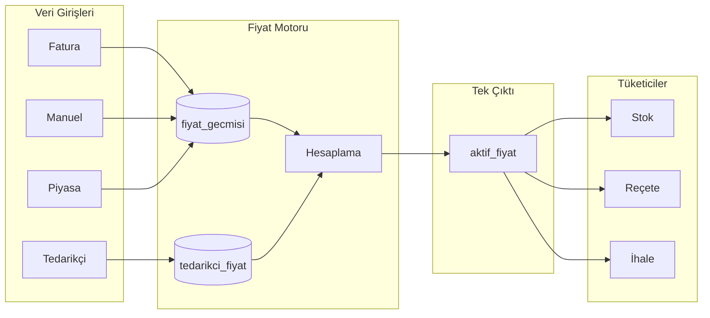
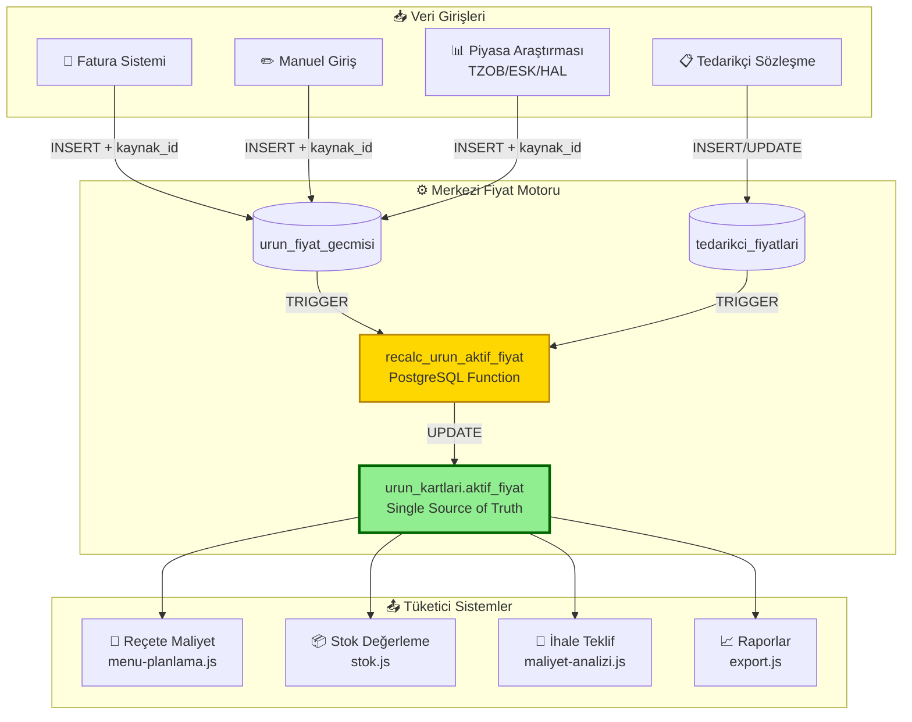
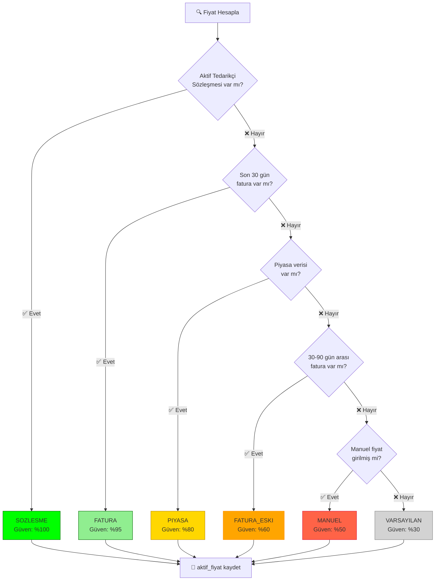
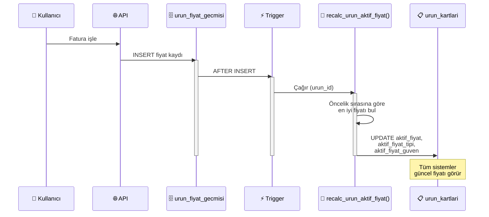
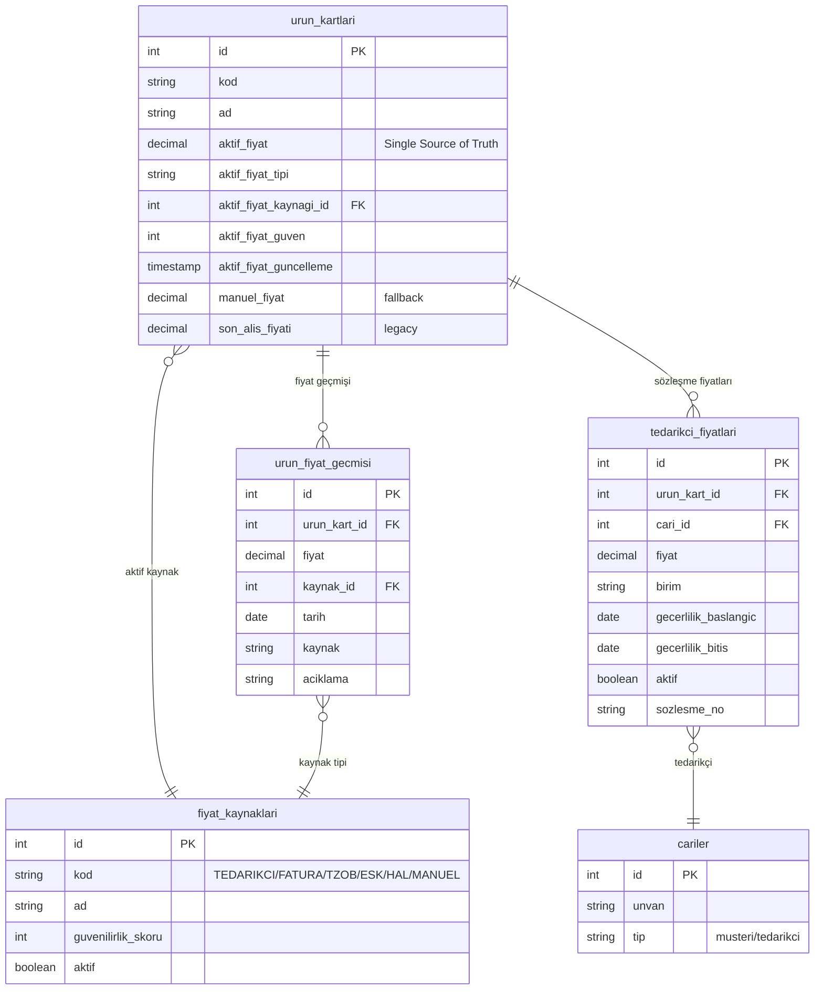

# Fiyat Yönetimi Mimari Diyagramları

## Ana Akış Diyagramı

---

## Detaylı Veri Akış Diyagramı

---

## Fiyat Öncelik Hiyerarşisi

---

## Trigger Akış Diyagramı

---

## Veritabanı İlişki Diyagramı

---

## Kullanım

Bu diyagramları görüntülemek için:

1. **GitHub/GitLab:** Markdown dosyasını doğrudan görüntüle
2. **VS Code:** Mermaid Preview eklentisi kullan
3. **Online:** [mermaid.live](https://mermaid.live) sitesine kodu yapıştır
4. **Export:** PNG/SVG olarak dışa aktar
