# Fiyat Yönetimi Mimari Diyagramları

## Ana Akış Diyagramı

```mermaid
flowchart LR
    subgraph inputs [Veri Girişleri]
        F[Fatura]
        T[Tedarikçi]
        M[Manuel]
        P[Piyasa]
    end

    subgraph motor [Fiyat Motoru]
        FG[(fiyat_gecmisi)]
        TF[(tedarikci_fiyat)]
        CALC[Hesaplama]
    end

    subgraph output [Tek Çıktı]
        AF[aktif_fiyat]
    end

    subgraph consumers [Tüketiciler]
        S[Stok]
        R[Reçete]
        I[İhale]
    end

    F --> FG
    T --> TF
    M --> FG
    P --> FG
    
    FG --> CALC
    TF --> CALC
    CALC --> AF
    
    AF --> S
    AF --> R
    AF --> I
```

---

## Detaylı Veri Akış Diyagramı

```mermaid
flowchart TB
    subgraph inputs [📥 Veri Girişleri]
        F[🧾 Fatura Sistemi]
        M[✏️ Manuel Giriş]
        T[📋 Tedarikçi Sözleşme]
        P[📊 Piyasa Araştırması<br/>TZOB/ESK/HAL]
    end

    subgraph core [⚙️ Merkezi Fiyat Motoru]
        FG[(urun_fiyat_gecmisi)]
        TF[(tedarikci_fiyatlari)]
        CALC[recalc_urun_aktif_fiyat<br/>PostgreSQL Function]
        CACHE[urun_kartlari.aktif_fiyat<br/>Single Source of Truth]
    end

    subgraph outputs [📤 Tüketici Sistemler]
        RECETE[🍳 Reçete Maliyet<br/>menu-planlama.js]
        STOK[📦 Stok Değerleme<br/>stok.js]
        IHALE[📑 İhale Teklif<br/>maliyet-analizi.js]
        RAPOR[📈 Raporlar<br/>export.js]
    end

    F -->|INSERT + kaynak_id| FG
    M -->|INSERT + kaynak_id| FG
    T -->|INSERT/UPDATE| TF
    P -->|INSERT + kaynak_id| FG
    
    FG -->|TRIGGER| CALC
    TF -->|TRIGGER| CALC
    CALC -->|UPDATE| CACHE
    
    CACHE --> RECETE
    CACHE --> STOK
    CACHE --> IHALE
    CACHE --> RAPOR

    style CACHE fill:#90EE90,stroke:#006400,stroke-width:3px
    style CALC fill:#FFD700,stroke:#B8860B,stroke-width:2px
```

---

## Fiyat Öncelik Hiyerarşisi

```mermaid
flowchart TD
    START[🔍 Fiyat Hesapla] --> CHECK1{Aktif Tedarikçi<br/>Sözleşmesi var mı?}
    
    CHECK1 -->|✅ Evet| SOZ[SOZLESME<br/>Güven: %100]
    CHECK1 -->|❌ Hayır| CHECK2{Son 30 gün<br/>fatura var mı?}
    
    CHECK2 -->|✅ Evet| FAT30[FATURA<br/>Güven: %95]
    CHECK2 -->|❌ Hayır| CHECK3{Piyasa verisi<br/>var mı?}
    
    CHECK3 -->|✅ Evet| PIY[PIYASA<br/>Güven: %80]
    CHECK3 -->|❌ Hayır| CHECK4{30-90 gün arası<br/>fatura var mı?}
    
    CHECK4 -->|✅ Evet| FAT90[FATURA_ESKI<br/>Güven: %60]
    CHECK4 -->|❌ Hayır| CHECK5{Manuel fiyat<br/>girilmiş mi?}
    
    CHECK5 -->|✅ Evet| MAN[MANUEL<br/>Güven: %50]
    CHECK5 -->|❌ Hayır| DEF[VARSAYILAN<br/>Güven: %30]
    
    SOZ --> SAVE[💾 aktif_fiyat kaydet]
    FAT30 --> SAVE
    PIY --> SAVE
    FAT90 --> SAVE
    MAN --> SAVE
    DEF --> SAVE

    style SOZ fill:#00FF00,stroke:#006400
    style FAT30 fill:#90EE90,stroke:#006400
    style PIY fill:#FFD700,stroke:#B8860B
    style FAT90 fill:#FFA500,stroke:#FF8C00
    style MAN fill:#FF6347,stroke:#DC143C
    style DEF fill:#D3D3D3,stroke:#808080
```

---

## Trigger Akış Diyagramı

```mermaid
sequenceDiagram
    participant User as 👤 Kullanıcı
    participant API as 🌐 API
    participant DB as 🗄️ urun_fiyat_gecmisi
    participant Trigger as ⚡ Trigger
    participant Func as 🔧 recalc_urun_aktif_fiyat()
    participant UK as 📋 urun_kartlari
    
    User->>API: Fatura işle
    API->>DB: INSERT fiyat kaydı
    activate DB
    DB->>Trigger: AFTER INSERT
    activate Trigger
    Trigger->>Func: Çağır (urun_id)
    activate Func
    Func->>Func: Öncelik sırasına göre<br/>en iyi fiyatı bul
    Func->>UK: UPDATE aktif_fiyat,<br/>aktif_fiyat_tipi,<br/>aktif_fiyat_guven
    deactivate Func
    deactivate Trigger
    deactivate DB
    
    Note over UK: Tüm sistemler<br/>güncel fiyatı görür
```

---

## Veritabanı İlişki Diyagramı

```mermaid
erDiagram
    urun_kartlari ||--o{ urun_fiyat_gecmisi : "fiyat geçmişi"
    urun_kartlari ||--o{ tedarikci_fiyatlari : "sözleşme fiyatları"
    urun_kartlari }o--|| fiyat_kaynaklari : "aktif kaynak"
    urun_fiyat_gecmisi }o--|| fiyat_kaynaklari : "kaynak tipi"
    tedarikci_fiyatlari }o--|| cariler : "tedarikçi"
    
    urun_kartlari {
        int id PK
        string kod
        string ad
        decimal aktif_fiyat "Single Source of Truth"
        string aktif_fiyat_tipi
        int aktif_fiyat_kaynagi_id FK
        int aktif_fiyat_guven
        timestamp aktif_fiyat_guncelleme
        decimal manuel_fiyat "fallback"
        decimal son_alis_fiyati "legacy"
    }
    
    urun_fiyat_gecmisi {
        int id PK
        int urun_kart_id FK
        decimal fiyat
        int kaynak_id FK
        date tarih
        string kaynak
        string aciklama
    }
    
    tedarikci_fiyatlari {
        int id PK
        int urun_kart_id FK
        int cari_id FK
        decimal fiyat
        string birim
        date gecerlilik_baslangic
        date gecerlilik_bitis
        boolean aktif
        string sozlesme_no
    }
    
    fiyat_kaynaklari {
        int id PK
        string kod "TEDARIKCI/FATURA/TZOB/ESK/HAL/MANUEL"
        string ad
        int guvenilirlik_skoru
        boolean aktif
    }
    
    cariler {
        int id PK
        string unvan
        string tip "musteri/tedarikci"
    }
```

---

## Kullanım

Bu diyagramları görüntülemek için:

1. **GitHub/GitLab:** Markdown dosyasını doğrudan görüntüle
2. **VS Code:** Mermaid Preview eklentisi kullan
3. **Online:** [mermaid.live](https://mermaid.live) sitesine kodu yapıştır
4. **Export:** PNG/SVG olarak dışa aktar
