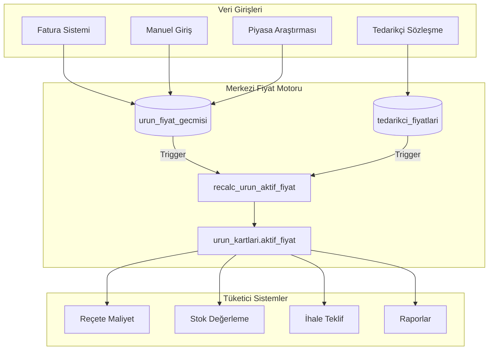
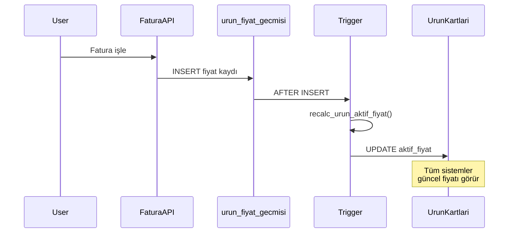

# Fiyat Yönetimi Sistemi

## Genel Bakış

Catering Pro'da merkezi fiyat yönetimi için **Single Source of Truth** mimarisi. Tüm sistemler (stok, menü planlama, ihale, raporlar) tek bir fiyat kaynağından okur.

## Mimari



## Fiyat Öncelik Sırası

| Öncelik | Kaynak | Güven Skoru | Açıklama |
|---------|--------|-------------|----------|
| 1 | SOZLESME | %100 | Aktif tedarikçi sözleşmesi |
| 2 | FATURA | %95 | Son 30 gün içindeki fatura |
| 3 | PIYASA | %80 | TZOB/ESK/HAL verileri |
| 4 | FATURA_ESKI | %60 | 30-90 gün arası fatura |
| 5 | MANUEL | %50 | Kullanıcı girişi |
| 6 | AI_TAHMINI | %40 | Claude AI piyasa tahmini |

> **Not:** VARSAYILAN (sahte/fallback fiyat) kaldırıldı. Fiyat yoksa AI tahmini yapılır veya NULL kalır.

## Veritabanı Şeması

### Ana Tablo: `urun_kartlari`

```sql
-- Merkezi fiyat alanları
aktif_fiyat DECIMAL(15,4)           -- Hesaplanmış güncel fiyat
aktif_fiyat_tipi VARCHAR(20)        -- SOZLESME/FATURA/PIYASA/MANUEL/VARSAYILAN
aktif_fiyat_kaynagi_id INTEGER      -- fiyat_kaynaklari.id referansı
aktif_fiyat_guncelleme TIMESTAMPTZ  -- Son hesaplama zamanı
aktif_fiyat_guven INTEGER           -- 0-100 güven skoru
```

### Destekleyici Tablolar

```sql
-- Fiyat geçmişi (tüm kaynaklar)
urun_fiyat_gecmisi
  ├── urun_kart_id
  ├── fiyat
  ├── kaynak_id → fiyat_kaynaklari.id
  ├── tarih
  └── ...

-- Tedarikçi sözleşmeleri
tedarikci_fiyatlari
  ├── urun_kart_id
  ├── cari_id → cariler.id
  ├── fiyat
  ├── gecerlilik_baslangic/bitis
  └── aktif

-- Fiyat kaynakları tanımları
fiyat_kaynaklari
  ├── kod (TEDARIKCI, FATURA, TZOB, ESK, HAL, MANUEL, AI_TAHMINI)
  ├── guvenilirlik_skoru
  └── aktif
```

## API Referansı

Base URL: `/api/fiyat-yonetimi`

### Dashboard
```
GET /dashboard
```
Özet istatistikler, kaynak dağılımı, uyarı sayıları.

### Ürün İşlemleri
```
GET    /urunler                    # Liste (filtrelenebilir)
GET    /urunler/:id                # Detay + geçmiş + tedarikçiler
GET    /urunler/:id/gecmis         # Fiyat geçmişi
GET    /urunler/:id/tedarikci      # Tedarikçi karşılaştırma
POST   /urunler/:id/hesapla        # Fiyat yeniden hesapla
POST   /urunler/:id/fiyat          # Manuel fiyat gir
POST   /urunler/:id/ai-tahmini     # AI ile fiyat tahmini
```

### AI Fiyat Tahmini
```
POST   /urunler/:id/ai-tahmini     # Tek ürün için AI tahmini
POST   /toplu/ai-tahmini           # Fiyatsız ürünler için toplu AI tahmini
```

### Tedarikçi Sözleşmeleri
```
GET    /sozlesmeler                # Tüm sözleşmeler
GET    /sozlesmeler/:cariId        # Tedarikçi detay
POST   /sozlesmeler/fiyat          # Sözleşme fiyat ekle/güncelle
DELETE /sozlesmeler/fiyat/:id      # Sözleşme fiyat sil
```

### Toplu İşlemler
```
POST   /toplu/yeniden-hesapla      # Tüm fiyatları hesapla
POST   /toplu/hesapla              # Seçili ürünler
POST   /toplu/guncelle             # Kategori bazlı %/TL güncelleme
```

### Uyarılar
```
GET    /uyarilar                   # Anomali ve eskimiş fiyatlar
PUT    /uyarilar/:id/okundu        # Okundu işaretle
PUT    /uyarilar/:id/cozuldu       # Çözüldü işaretle
POST   /uyarilar/toplu-okundu      # Toplu okundu
```

## Frontend Bileşenleri

```
frontend/src/app/muhasebe/fiyat-yonetimi/
├── page.tsx                 # Ana sayfa (3 tab: Ürün Listesi, Sözleşmeler, Fiyat Güncelleme)
└── components/
    ├── UrunListesi.tsx      # Filtrelenebilir ürün tablosu + AI_TAHMINI badge
    ├── UrunDetay.tsx        # Drawer - geçmiş, grafik, tedarikçiler, AI Tahmini butonu
    ├── TedarikciSozlesme.tsx # Sözleşme yönetimi
    └── FiyatGuncelleme.tsx  # Toplu işlemler, piyasa verileri, AI tahmini
```

### UI Özellikleri
- **AI Tahmini Badge:** Mor renkli robot ikonu ile gösterilir
- **Tek Ürün AI Tahmini:** Ürün detayında "AI Tahmini" butonu
- **Toplu AI Tahmini:** Fiyat Güncelleme tabında tüm fiyatsız ürünler için

## Entegrasyonlar

### Stok Modülü
- `stok.js`: `COALESCE(aktif_fiyat, son_alis_fiyati)` kullanır
- `stok/page.tsx`: Fiyat kolonunda kaynak badge'i gösterir

### Menü Planlama
- `menu-planlama.js`: Reçete maliyet hesabında `COALESCE(aktif_fiyat, son_alis_fiyati)` kullanır
- `maliyet-analizi.js`: Aynı fiyat mantığı ile maliyet hesaplar
- Frontend: Ürünler/Fiyatlar tabları kaldırıldı, fiyat yönetimi ayrı sayfada
- Fiyat düzenleme linki: Ürün detayında "Fiyat Yönetimi" sayfasına yönlendirir

### Fatura Sistemi
- Fatura girişi → `urun_fiyat_gecmisi`'e INSERT
- Trigger → `aktif_fiyat` otomatik güncellenir

## Kullanım Örnekleri

### Manuel Fiyat Girişi
```javascript
// Frontend'den
await fetch(`${API_BASE_URL}/api/fiyat-yonetimi/urunler/${urunId}/fiyat`, {
  method: 'POST',
  headers: { 'Content-Type': 'application/json', Authorization: `Bearer ${token}` },
  body: JSON.stringify({ fiyat: 650, birim: 'kg', aciklama: 'Piyasa araştırması' })
});
```

### Toplu Fiyat Güncelleme
```javascript
// Tüm sebzelere %10 zam
await fetch(`${API_BASE_URL}/api/fiyat-yonetimi/toplu/guncelle`, {
  method: 'POST',
  headers: { 'Content-Type': 'application/json', Authorization: `Bearer ${token}` },
  body: JSON.stringify({ 
    kategori_id: 5, // Sebzeler
    islem: 'yuzde_artir',
    deger: 10,
    aciklama: 'Şubat 2026 enflasyon güncellemesi'
  })
});
```

## Trigger ve Otomatik Güncelleme



## Migration Geçmişi

| Migration | Açıklama |
|-----------|----------|
| 114_fiyat_yonetim_sistemi | Temel tablolar, kaynaklar, tedarikçi fiyatları |
| 115_fiyat_mimarisi | aktif_fiyat alanları, trigger, view'lar |
| 118_fiyat_varsayilan_kaldir | VARSAYILAN kaldırıldı, AI_TAHMINI eklendi |

## Performans

- `idx_urun_kartlari_aktif_fiyat` - Fiyatlı ürün sorguları
- `idx_urun_fiyat_gecmisi_tarih_kaynak` - Geçmiş sorguları
- View'lar: `v_urun_fiyat_durumu`, `v_fiyat_ozet`, `v_kategori_fiyat_durumu`
