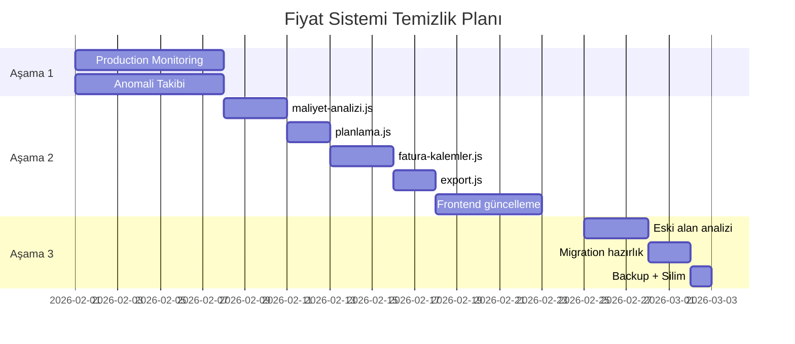

# Eski Fiyat Sistemleri Temizlik Planı

## Mevcut Durum Analizi

### Eski Fiyat Alanları (DEPRECATED)

| Tablo | Alan | Kullanım | Durum |
|-------|------|----------|-------|
| `urun_kartlari` | `manuel_fiyat` | Migration 113 varsayılan değerleri | KALACAK (fallback) |
| `urun_kartlari` | `son_alis_fiyati` | Fatura girişinden otomatik | KALACAK (geçmiş uyumluluk) |
| `urun_kartlari` | `ortalama_fiyat` | Hesaplanan ortalama | SİLİNEBİLİR |
| `urun_kartlari` | `min_fiyat` | Piyasa min | SİLİNEBİLİR |
| `urun_kartlari` | `max_fiyat` | Piyasa max | SİLİNEBİLİR |
| `urun_kartlari` | `fiyat_guven_skoru` | Eski güven skoru | KALACAK (mapping) |

### Yeni Merkezi Alanlar (AKTİF)

| Alan | Açıklama |
|------|----------|
| `aktif_fiyat` | Hesaplanmış güncel fiyat |
| `aktif_fiyat_tipi` | Kaynak tipi |
| `aktif_fiyat_kaynagi_id` | Kaynak referansı |
| `aktif_fiyat_guncelleme` | Son hesaplama |
| `aktif_fiyat_guven` | Güven skoru |

## Temizlik Aşamaları

### Aşama 1: Stabilizasyon (1-2 Hafta)
**Hedef:** Yeni sistem çalışır durumda, eski veriler korunuyor

- [x] Migration 115 çalıştırıldı
- [x] `aktif_fiyat` trigger aktif
- [x] Tüm ürünler için `recalc_urun_aktif_fiyat()` çalıştırıldı
- [ ] Production'da 1 hafta monitoring
- [ ] Anomali ve hata takibi

### Aşama 2: Kod Temizliği (2-3 Hafta)
**Hedef:** Tüm backend/frontend `aktif_fiyat` kullanıyor

#### Backend Güncellemeleri

```javascript
// ESKİ (son_alis_fiyati)
const fiyat = urun.son_alis_fiyati || urun.manuel_fiyat || 0;

// YENİ (aktif_fiyat)
const fiyat = urun.aktif_fiyat || 0;
```

| Dosya | Durum | Not |
|-------|-------|-----|
| `stok.js` | GÜNCELLENDI | `COALESCE(aktif_fiyat, son_alis_fiyati)` |
| `menu-planlama.js` | GÜNCELLENDI | `aktif_fiyat` öncelikli |
| `maliyet-analizi.js` | BEKLIYOR | `hesaplaAktifFiyat()` servisi kullanmalı |
| `urunler.js` | BEKLIYOR | Fiyat güncelleme trigger'a bağlı |
| `fatura-kalemler.js` | BEKLIYOR | Trigger aktif, direkt güncelleme kaldırılmalı |
| `planlama.js` | BEKLIYOR | `aktif_fiyat` okumalı |
| `export.js` | BEKLIYOR | Rapor sorgularında `aktif_fiyat` kullanmalı |

#### Frontend Güncellemeleri

| Dosya | Durum | Not |
|-------|-------|-----|
| `stok/page.tsx` | GÜNCELLENDI | Badge + Tooltip eklendi |
| `stok/types.ts` | GÜNCELLENDI | Yeni alanlar eklendi |
| `stok/useStokData.tsx` | GÜNCELLENDI | Parse güncellendi |
| `fiyat-yonetimi/page.tsx` | YENİ | Merkezi yönetim sayfası |
| `menu-planlama/` | BEKLIYOR | Fiyat güven göstergesi eklenecek |

### Aşama 3: Eski Alan Silimi (4+ Hafta)
**Hedef:** Gereksiz alanlar kaldırıldı

#### Migration: Eski Alanları Sil (ÖNERİLEN DEĞİL - ŞUAN İÇİN)

```sql
-- DİKKAT: Bu migration sadece tüm sistemler stabil olduktan sonra çalıştırılmalı!
-- Backup almadan ÇALIŞTIRMAYIN!

-- Silinecek kolonlar
ALTER TABLE urun_kartlari DROP COLUMN IF EXISTS ortalama_fiyat;
ALTER TABLE urun_kartlari DROP COLUMN IF EXISTS min_fiyat;
ALTER TABLE urun_kartlari DROP COLUMN IF EXISTS max_fiyat;

-- KALACAK KOLONLAR (geriye uyumluluk için)
-- manuel_fiyat: Varsayılan değerler için
-- son_alis_fiyati: Fatura bazlı hızlı erişim için
-- fiyat_guven_skoru: Eski güven skoru (mapping için)
```

## Kod Değişikliği Detayları

### maliyet-analizi.js Güncelleme

```javascript
// ESKİ
const maliyet = await hesaplaMalzemeMaliyet({
  fatura_fiyat: m.fatura_fiyat,
  piyasa_fiyat: m.piyasa_fiyat,
  // ...
});

// YENİ
import { hesaplaAktifFiyat } from '../services/fiyat-motor.js';

const { fiyat, guven } = await hesaplaAktifFiyat(m.urun_kart_id);
const maliyet = miktar * fiyat;
```

### planlama.js Güncelleme

```javascript
// ESKİ
const result = await query(`
  SELECT uk.son_alis_fiyati as fiyat ...
`);

// YENİ
const result = await query(`
  SELECT COALESCE(uk.aktif_fiyat, uk.son_alis_fiyati) as fiyat,
         uk.aktif_fiyat_guven as guven ...
`);
```

### fatura-kalemler.js Güncelleme

```javascript
// ESKİ - Direkt son_alis_fiyati güncelleme
await query('UPDATE urun_kartlari SET son_alis_fiyati = $1 WHERE id = $2', [fiyat, id]);

// YENİ - Sadece fiyat geçmişine ekle, trigger halleder
await query(`
  INSERT INTO urun_fiyat_gecmisi (urun_kart_id, fiyat, kaynak_id, ...)
  VALUES ($1, $2, (SELECT id FROM fiyat_kaynaklari WHERE kod = 'FATURA'), ...)
`, [urunId, fiyat]);
// Trigger otomatik aktif_fiyat'ı hesaplar
```

## Test Planı

### Birim Testler

```javascript
// Fiyat hesaplama testi
describe('recalc_urun_aktif_fiyat', () => {
  it('tedarikçi sözleşmesi varsa onu kullanmalı', async () => {
    // Sözleşme ekle
    await query(`INSERT INTO tedarikci_fiyatlari (...) VALUES (...)`);
    
    // Hesapla
    const result = await query('SELECT * FROM recalc_urun_aktif_fiyat($1)', [urunId]);
    
    expect(result.rows[0].tip).toBe('SOZLESME');
    expect(result.rows[0].guven).toBe(100);
  });
  
  it('sözleşme yoksa son faturayı kullanmalı', async () => {
    // Fatura ekle (30 gün içinde)
    await query(`INSERT INTO urun_fiyat_gecmisi (...) VALUES (...)`);
    
    const result = await query('SELECT * FROM recalc_urun_aktif_fiyat($1)', [urunId]);
    
    expect(result.rows[0].tip).toBe('FATURA');
    expect(result.rows[0].guven).toBe(95);
  });
});
```

### Entegrasyon Testler

1. **Fatura İşleme Akışı**
   - Fatura gir → Fiyat geçmişi kaydı oluşur → Trigger çalışır → aktif_fiyat güncellenir

2. **Menü Maliyet Hesabı**
   - Reçete oluştur → Maliyet hesapla → aktif_fiyat kullanılır → Güven skoru gösterilir

3. **Stok Değerleme**
   - Stok listesi → aktif_fiyat * miktar = değer

## Monitoring

### Dashboard Metrikleri

- Toplam ürün sayısı
- Güncel fiyatlı ürün oranı (7 gün içinde güncellenen)
- Kaynak dağılımı (Sözleşme/Fatura/Piyasa/Manuel/Varsayılan)
- Ortalama güven skoru
- Anomali uyarı sayısı

### Alert Kuralları

```sql
-- Eskimiş fiyat sayısı > 50 ise uyar
SELECT COUNT(*) FROM urun_kartlari 
WHERE aktif = true 
  AND (aktif_fiyat_guncelleme < NOW() - INTERVAL '30 days' 
       OR aktif_fiyat_guncelleme IS NULL);

-- Düşük güvenli fiyat sayısı > 100 ise uyar
SELECT COUNT(*) FROM urun_kartlari 
WHERE aktif = true AND aktif_fiyat_guven < 50;
```

## Rollback Planı

Eğer yeni sistem sorun çıkarırsa:

```sql
-- aktif_fiyat yerine son_alis_fiyati kullan
UPDATE urun_kartlari 
SET aktif_fiyat = son_alis_fiyati,
    aktif_fiyat_tipi = 'FATURA',
    aktif_fiyat_guven = 95
WHERE aktif = true AND son_alis_fiyati IS NOT NULL;

-- Trigger'ı devre dışı bırak (gerekirse)
DROP TRIGGER IF EXISTS trg_recalc_aktif_fiyat ON urun_fiyat_gecmisi;
```

## Zaman Çizelgesi



## Sorumlu Kişiler

| Aşama | Sorumlu | Onaylayan |
|-------|---------|-----------|
| Aşama 1 | DevOps | Teknik Lider |
| Aşama 2 | Backend Dev | Teknik Lider |
| Aşama 3 | DBA | CTO |
